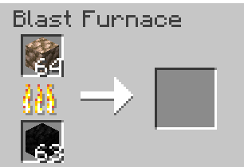

# Blasted Ore Blocks

## Description

Allows you to smelt raw ore blocks directly into its block version using a blast furnace. Works with raw iron, copper, and gold.

## Recipe

<figure><figcaption></figcaption></figure>

